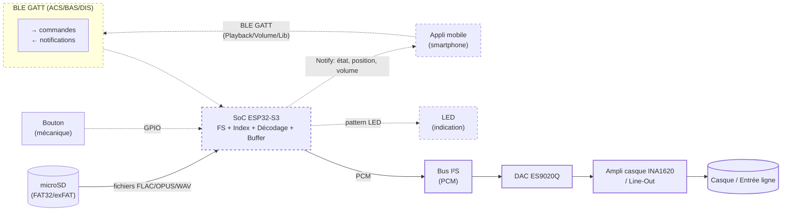
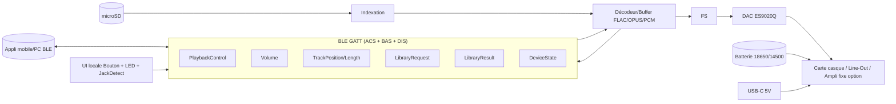
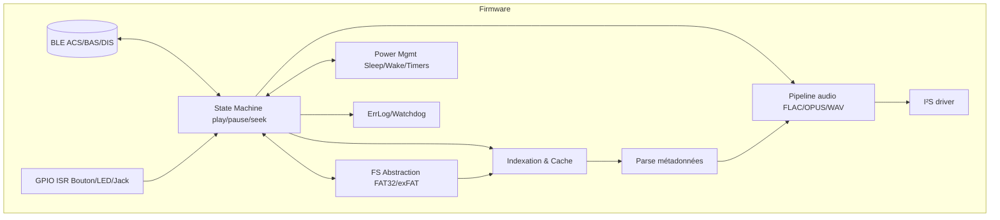
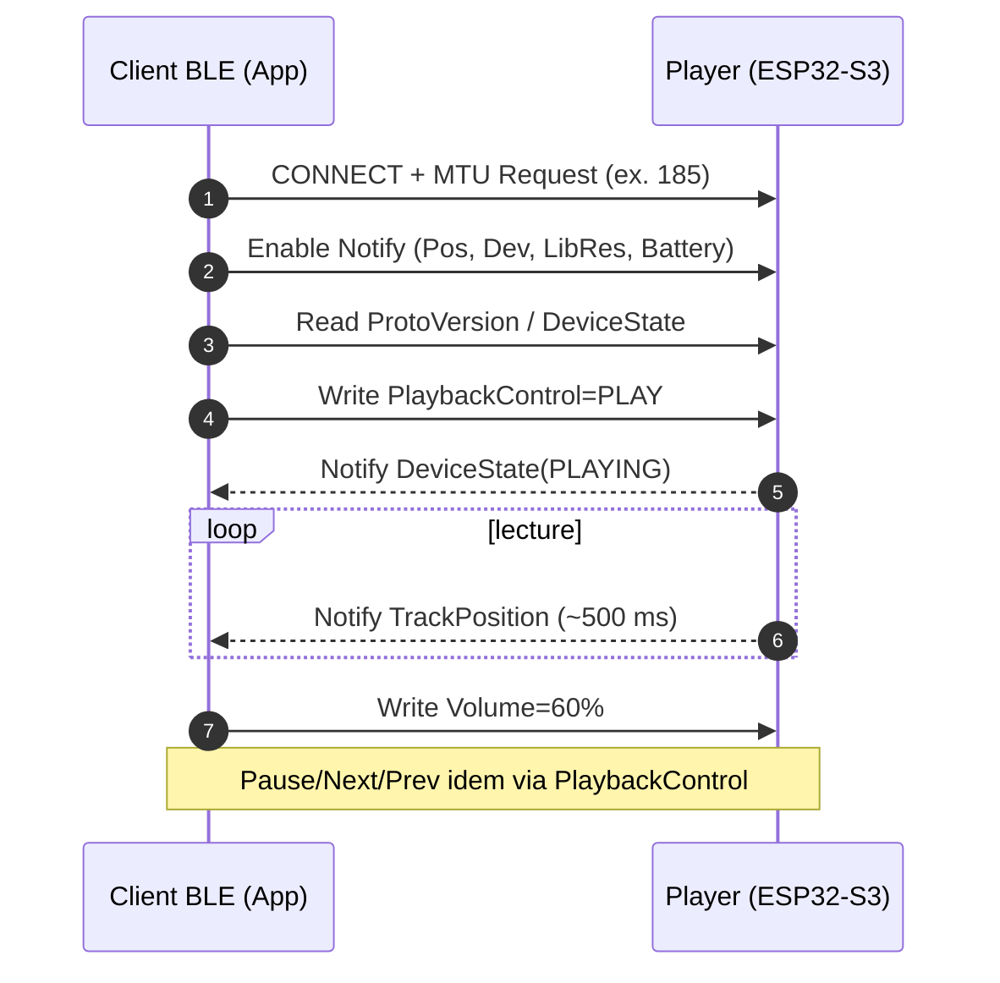
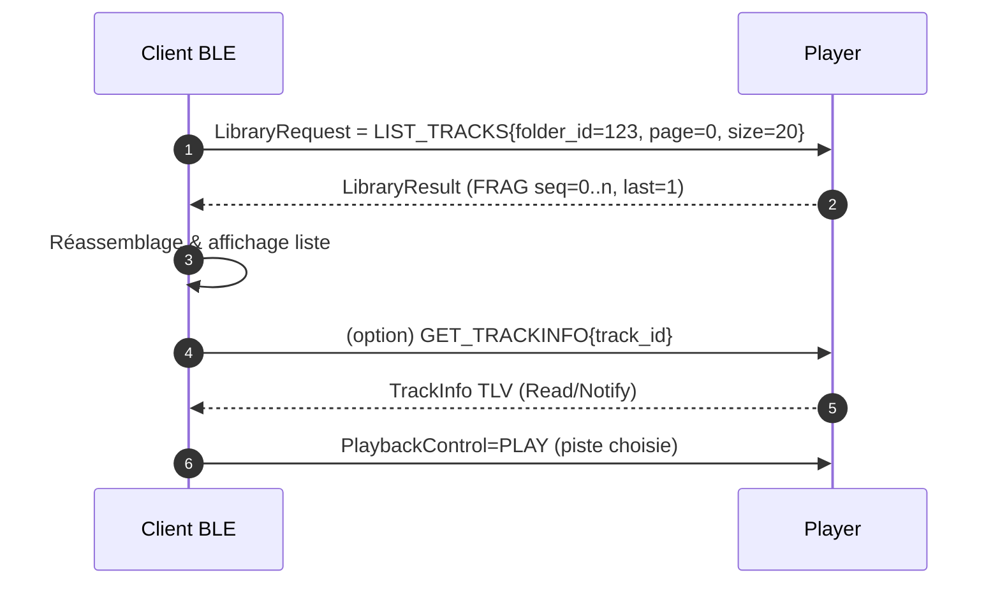
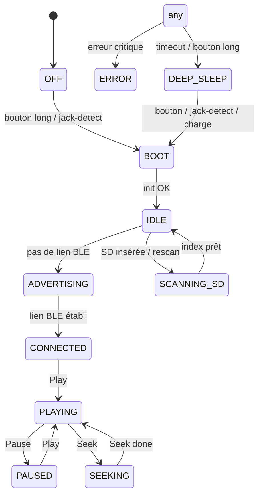
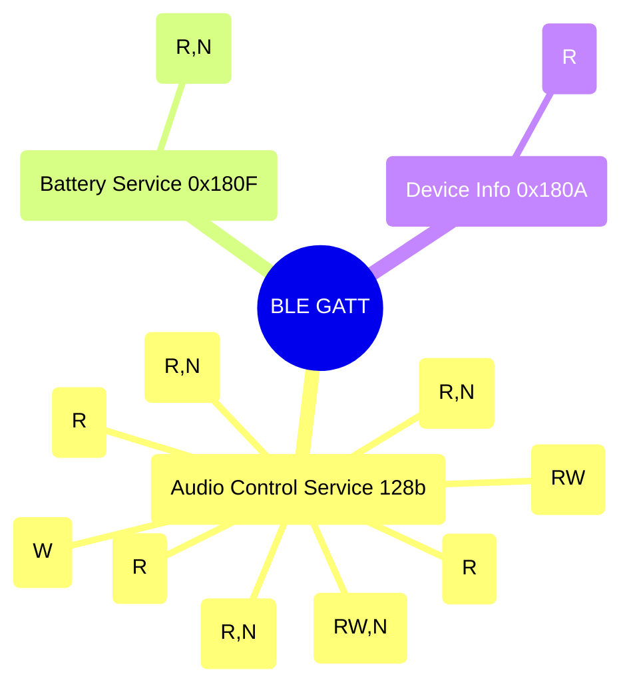
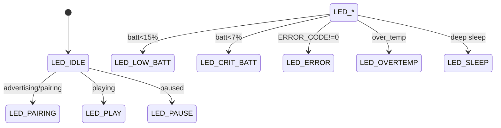

<!-- SPDX-License-Identifier: CC-BY-SA-4.0 -->

# Diagrammes — Baladeur SD sans écran (contrôle BLE)

Ce fichier regroupe les schémas **Mermaid** de référence à inclure dans le cahier des charges / la documentation. Copier/coller tel quel dans `docs/diagrams.md` du dépôt.

---





## 1) Flux logiques (données + contrôle) — v2



---

## 2) Modules firmware (niveau 1) — v2



---

## 3) Séquence : connexion & lecture



---

## 4) Séquence : parcours bibliothèque



---

## 5) États principaux du lecteur (FSM)



---

## 6) Domaines d’alimentation & sources de réveil

```mermaid
flowchart LR
  Batt[(Batterie 3.7V)] --> SW[Inter général]
  USB[USB-C 5V] --> OR[Diode-OR / Power Path]
  SW --> OR
  OR --> LDO_A[Reg 3.3V analog<br/>(LDO low-noise)]
  OR --> LDO_D[Reg 3.3V digital]
  LDO_D --> SoC[ESP32-S3]
  LDO_A --> DAC[ES9020Q] --> AMP[INA1620/Line-Out]
  BTN[Bouton] -->|Wake| SoC
  JACK[Jack Detect] -->|Wake| SoC
  RTC[Timer/RTC] -->|Wake| SoC
  SoC -. "BLE adv" .-> Antenna((BLE))
```

---

## 7) Carte GATT — vue d’ensemble



---

## 8) (Option) FSM d’indication LED

> Voir la table détaillée dans `firmware/docs/ble-gatt.md` §17. Ce mini schéma illustre le **chemin nominal**.



---

## Notes d’utilisation

- Ces diagrammes **n’exposent pas** d’API réseau/audio : le BLE sert **au contrôle** uniquement ; l’audio reste **local** (microSD → I²S → DAC).
- Conserver ce fichier sous **CC-BY-SA-4.0** ; les fichiers matériels sont sous **CERN-OHL-S-2.0** (voir `LICENSES/`).

