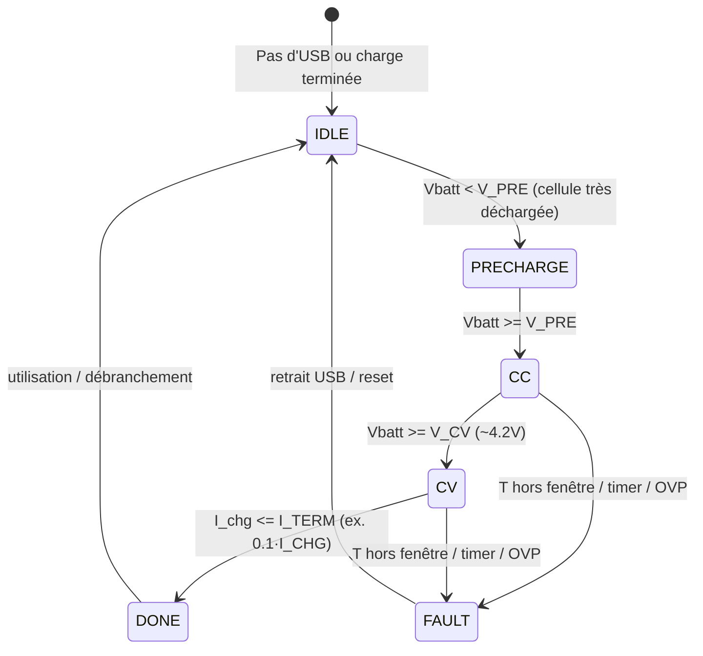

# Spécification BLE GATT — Baladeur SD sans écran (v1.0.1)

> **Projet** : lecteur audio local (microSD) sans écran, contrôle uniquement en **Bluetooth Low Energy** (BLE). **Portée** : définition du **GATT** (services, caractéristiques, formats, sécurité, séquences), côté périphérique (ESP32‑S3) et côté client (appli mobile/PC).

---

## 0. Conventions

- **MUST/SHOULD/MAY** selon [RFC 2119] : impératif/recommandé/facultatif.
- **Endianness** : toutes les valeurs numériques sont **little‑endian**.
- **Unités** : explicitement précisées (ms, Hz, dB, %).
- **Taille** : `u8/u16/u32/s16/...` = entiers non signés/signés, nombre d’octets.
- **TLV** : Tag (u8) + Length (u16) + Value (bytes), sauf mention contraire.
- **MTU** : par défaut 23 ; les clients DOIVENT gérer la **fragmentation** (voir §6.3).

---

## 1. Aperçu

Le périphérique expose **2 services standards** et **1 service propriétaire** :

- **Device Information Service (DIS)** — UUID 0x180A (standard)
- **Battery Service (BAS)** — UUID 0x180F (standard)
- **Audio Control Service (ACS)** — **personnalisé 128‑bit** (contrôle lecture/état, navigation bibliothèque, métadonnées minimalistes)

Le **flux audio** ne transite **pas** par BLE (BLE = **contrôle + télémétrie** seulement). La lecture se fait localement depuis microSD → décodeur → I²S → DAC.

---

## 2. UUIDs

### 2.1. Base UUID propriétaire

- **BASE\_UUID** : `A6E1xxxx-3B45-4E4C-9A42-0A6414F0B2D3`
- `xxxx` est un **identifiant 16‑bit** inséré (hex, minuscule/majuscule indifférent).

> Vous POUVEZ remplacer cette base par la vôtre avant gel de v1.0.0. Une méthode robuste consiste à dériver des UUID **v5** (namespace + nom), ou à générer un UUID **v4** aléatoire puis décliner les caractéristiques en incrémentant la partie 16‑bit (`0x1000`, `0x1001`, ...).

### 2.2. Affectations

- **Service Audio Control (ACS)** : `A6E11000-3B45-4E4C-9A42-0A6414F0B2D3` (`0x1000`)

- **Characteristics (ACS)** :

  - `PlaybackControl` : `A6E11001-3B45-4E4C-9A42-0A6414F0B2D3` (`0x1001`)
  - `VolumePercent`  : `A6E11002-3B45-4E4C-9A42-0A6414F0B2D3` (`0x1002`)
  - `TrackPosition`  : `A6E11003-3B45-4E4C-9A42-0A6414F0B2D3` (`0x1003`)
  - `TrackLength`    : `A6E11004-3B45-4E4C-9A42-0A6414F0B2D3` (`0x1004`)
  - `TrackInfo`      : `A6E11005-3B45-4E4C-9A42-0A6414F0B2D3` (`0x1005`)
  - `LibraryRequest` : `A6E11006-3B45-4E4C-9A42-0A6414F0B2D3` (`0x1006`)
  - `LibraryResult`  : `A6E11007-3B45-4E4C-9A42-0A6414F0B2D3` (`0x1007`)
  - `DeviceState`    : `A6E11008-3B45-4E4C-9A42-0A6414F0B2D3` (`0x1008`)
  - `ProtoVersion`   : `A6E110FF-3B45-4E4C-9A42-0A6414F0B2D3` (`0x10FF`)

- **Services/Chars standards** :

  - **DIS** (0x180A) : *Manufacturer Name* (0x2A29), *Model Number* (0x2A24), *Firmware Revision* (0x2A26)
  - **BAS** (0x180F) : *Battery Level* (0x2A19)

---

## 3. Tableau GATT (résumé)

| Service | Caractéristique       | UUID                 | Props    | Long. | Unité  | Description                                                   |
| ------- | --------------------- | -------------------- | -------- | ----- | ------ | ------------------------------------------------------------- |
| **ACS** | **PlaybackControl**   | `A6E11001-...`       | **RW**   | 1+    | opcode | Commandes de transport (Play/Pause/Next/Prev, Seek, etc.)     |
| **ACS** | **VolumePercent**     | `A6E11002-...`       | **RW**,N | 1     | %      | Volume logique 0..100 (mapping → dB côté firmware)            |
| **ACS** | **TrackPosition**     | `A6E11003-...`       | R,**N**  | 4     | ms     | Position courante (u32 ms)                                    |
| **ACS** | **TrackLength**       | `A6E11004-...`       | R        | 4     | ms     | Durée de la piste                                             |
| **ACS** | **TrackInfo**         | `A6E11005-...`       | R        | var   | TLV    | Métadonnées minimales piste (codec, sr, bitdepth, ids, titre) |
| **ACS** | **LibraryRequest**    | `A6E11006-...`       | **W**    | var   | TLV    | Requêtes de navigation (liste dossiers/pistes)                |
| **ACS** | **LibraryResult**     | `A6E11007-...`       | R,**N**  | var   | TLV    | Réponses paginées (fragmentables)                             |
| **ACS** | **DeviceState**       | `A6E11008-...`       | R,**N**  | 4     | bits   | État global (présence SD, lecture, batt faible...)            |
| **ACS** | **ProtoVersion**      | `A6E110FF-...`       | R        | 3     | semver | Version protocole (MAJ.MIN.PATCH)                             |
| **BAS** | **Battery Level**     | 0x2A19               | R,**N**  | 1     | %      | Niveau batterie (0..100)                                      |
| **DIS** | Manufacturer/Model/FW | 0x2A29/0x2A24/0x2A26 | R        | var   | texte  | Infos appareil                                                |

> **N** = Notify (n’oubliez pas d’activer le **CCCD** côté client pour recevoir les notifications).

---

## 4. Détails par caractéristique

### 4.1 PlaybackControl (RW, 1+ octet)

- **Format** : `opcode:u8` puis **payload dépendant** (optionnel).
- **Opcodes (MUST)** :
  - `0x00 STOP`
  - `0x01 PLAY`
  - `0x02 PAUSE`
  - `0x03 PREV`
  - `0x04 NEXT`
- **Opcodes (SHOULD)** :
  - `0x10 SEEK_REL` (`s16` millisecondes)
  - `0x11 SEEK_ABS` (`u32` millisecondes)
- **Opcodes (MAY)** :
  - `0x20 SHUFFLE_SET` (`u8` 0/1)
  - `0x21 REPEAT_SET` (`u8` 0=off,1=one,2=all)
- **Réponses** : cette caractéristique ne notifie pas directement ; l’avancement se lit via **TrackPosition**/**DeviceState**. Les erreurs se signalent via **codes d’erreur GATT** (Write Not Permitted, Invalid PDU) ou via **DeviceState.flags** (bit `ERROR` + code dans un sous-champ, cf. §4.7).

### 4.2 VolumePercent (RW,N, 1 octet)

- **Plage** : `0..100` (%).
- **Mapping interne vers dB** (informel) : `vol_db = -60 + 0.6 * percent` (ex.). Le firmware PEUT utiliser une loi logarithmique différente ; la relation exacte n’est pas exposée.
- **Notifies** : envoyées en cas de changement (bouton, appli, auto‑gain futur).

### 4.3 TrackPosition (R,N, 4 octets u32)

- **Unité** : millisecondes depuis début piste.
- **Notifies** : cadencées toutes les \~500 ms (SHOULD) ou lors des seeks.

### 4.4 TrackLength (R, 4 octets u32)

- **Unité** : millisecondes. `0` si inconnu (ex. flux) — mais v1 vise fichiers locaux → valeur connue.

### 4.5 TrackInfo (R, TLV variable)

- **Encodage TLV** (Tag\:u8, Len\:u16, Value\:bytes) :
  - `0x01 folder_id` (`u32`)
  - `0x02 track_id` (`u32`)
  - `0x03 title` (UTF‑8, sans NUL)
  - `0x04 artist` (UTF‑8) *(MAY)*
  - `0x05 album` (UTF‑8) *(MAY)*
  - `0x06 samplerate_hz` (`u32`)
  - `0x07 bit_depth` (`u8`)
  - `0x08 duration_ms` (`u32`)
  - `0x09 codec` (`u8` : 1=FLAC, 2=OPUS, 3=PCM, 4=AAC (si ajouté))
  - `0x0A bitrate_bps` (`u32`) *(MAY)*
  - `0xFE flags` (`u32`) *(MAY)*
  - `0xFF end` (Len=0)

**Exemple** (titre="Song", 48 kHz/24b, FLAC, 3 min) :

```
03 00 04 00 53 6F 6E 67   # title TLV (tag=0x03, len=4, "Song")
06 00 04 00 80 BB 00 00   # samplerate 48000
07 00 01 00 18            # bit_depth 24
08 00 04 00 40 6B 0B 00   # duration 180000 ms
09 00 01 00 01            # codec FLAC
FF 00 00 00               # end
```

### 4.6 LibraryRequest (W, TLV variable)

- **But** : demander une **liste paginée** de dossiers/pistes.
- **Commandes** (champ `cmd:u8` en tête, HORS TLV, pour simplicité) :
  - `0x01 LIST_FOLDERS` TLV : `{ parent_id (u32, tag=0x01), page (u16,0x02), page_size (u16,0x03) }`
  - `0x02 LIST_TRACKS`  TLV : `{ folder_id (u32,0x01), page (u16,0x02), page_size (u16,0x03) }`
  - `0x03 GET_TRACKINFO` TLV : `{ track_id (u32,0x04) }`
- **Pagination** : `page>=0`, `1<=page_size<=50` recommandé.
- **Réponse** : via **LibraryResult** (Notify multiples possibles).

### 4.7 LibraryResult (R,N, TLV variable, fragmentable)

Chaque notification contient **un ou plusieurs enregistrements** encodés TLV dans un **contenant FRAG** :

- En‑tête FRAG : `u8 frag_seq`, `u8 frag_last` (0/1), `u16 payload_len`, puis **payload TLV**.
- **Enregistrements** :
  - Dossier (`tag=0x20`) : `{ folder_id:u32, name:utf8 }`
  - Piste (`tag=0x21`)   : `{ track_id:u32, title:utf8, duration_ms:u32 (MAY) }`
- Le client **réassemble** en concaténant `payload` par `frag_seq` jusqu’à `frag_last=1`.

### 4.8 DeviceState (R,N, 4 octets bits)

- **Layout** (`u32`) :
  - bit0 `SD_PRESENT`
  - bit1 `PLAYING`
  - bit2 `PAUSED`
  - bit3 `LOW_BATT`
  - bit4 `OVER_TEMP`
  - bit5 `MUTED` *(MAY)*
  - bits8..15 `ERROR_CODE` (u8, 0=OK, ex. 1=FS\_ERR, 2=DECODE\_ERR, 3=SD\_IO\_ERR)
  - autres **réservés 0**

### 4.9 ProtoVersion (R, 3 octets)

- **SemVer compact** : `{MAJ:u8, MIN:u8, PATCH:u8}`. Exemple : `01 00 00` pour 1.0.0.

---

## 5. Services standards

### 5.1 Battery Service (0x180F)

- **Battery Level (0x2A19)** : `u8` 0..100 ; **Notify** sur variation ≥1 % (SHOULD, anti‑spam : min 3 s entre notifies).

### 5.2 Device Information Service (0x180A)

- **Manufacturer Name (0x2A29)**, **Model Number (0x2A24)**, **Firmware Revision (0x2A26)** — chaînes UTF‑8.

---

## 6. MTU, fragmentation, timing

### 6.1 Négociation MTU

- Le périphérique **accepte** une MTU jusqu’à **185** (ESP‑IDF valeur courante). Le client DOIT gérer le cas **MTU=23**.

### 6.2 Tailles utiles

- **ATT payload utile** : `MTU - 3` octets.
- Les caractéristiques à **longueur variable** (TrackInfo, Library\*) DOIVENT **se fragmenter** côté serveur si nécessaire.

### 6.3 Fragmentation FRAG (LibraryResult)

- Voir §4.7 : champ d’en‑tête `(seq,last,len)` pour reconstitution client.

### 6.4 Cadence notifications

- **TrackPosition** : \~**500 ms** (SHOULD), suspendre en **Pause**.
- **DeviceState**/**Battery** : uniquement **sur changement** (debounce ≥ 200 ms).

---

## 7. Sécurité & appairage

- **Niveau minimal** : accès **lecture** sans chiffrement, **écriture** (Playback/Volume/LibraryRequest) **requiert** **chiffrement** (Security Mode 1 Level 2, *Just Works*) — **MUST**.
- **Option** : **bonding** + **Passkey** (Mode 1 Level 3) — **SHOULD** pour production.
- **Changement de nom BLE** et effacement des pairs via une commande de maintenance (hors de ce GATT, ou via une caractéristique admin cachée, non définie ici v1).

---

## 8. Paramètres de liaison recommandés

- **PHY** : 1M (par défaut).
- **Conn. interval** préféré : **45–60 ms** (équilibre réactivité/énergie).
- **Supervision timeout** : 4–6 s.
- **Slave latency** : 0–2.

---

## 9. Séquences d’usage (exemples)

### 9.1 Connexion & démarrage

1. Client se connecte, négocie MTU (ex. 185).
2. Active **CCCD** sur `TrackPosition`, `LibraryResult`, `DeviceState`, `Battery`.
3. Lit `ProtoVersion`, `DeviceState`, `TrackInfo`, `TrackLength`, `TrackPosition`.

### 9.2 Lecture d’une piste

1. `WRITE PlaybackControl = 0x01 (PLAY)`
2. Réception **DeviceState** (bit `PLAYING`), **TrackPosition** notifie périodiquement.
3. `WRITE VolumePercent = 60` (si désiré)

### 9.3 Parcours bibliothèque (liste pistes d’un dossier)

1. `WRITE LibraryRequest`: `cmd=0x02 LIST_TRACKS`, TLV `{folder_id=123, page=0, page_size=20}`
2. Recevoir 1..N `Notify LibraryResult` (FRAG), reconstituer et afficher.
3. Pour infos d’une piste : `cmd=0x03 GET_TRACKINFO {track_id}` puis lire **TrackInfo** (ou recevoir en `LibraryResult` si inclus).

### 9.4 Seek absolu à 2:00

1. `WRITE PlaybackControl = 0x11 SEEK_ABS | payload 120000 (ms)`
2. `TrackPosition` notifie \~120000 ; `DeviceState` reste PLAYING.

---

## 10. Gestion erreurs

- **Erreur GATT** standard à l’écriture\*\* :
  - 0x03 *Write Not Permitted* (non chiffré, ou écriture sur char read‑only)
  - 0x0D *Invalid Attribute Value Length* (payload incohérent)
  - 0x0E *Unlikely Error* (erreur interne)
- **Erreur métier** côté état\*\* : `DeviceState.ERROR_CODE` (bits 8..15) :
  - `0` OK
  - `1` `FS_ERR` (carte absente, index invalide)
  - `2` `DECODE_ERR` (codec/format)
  - `3` `SD_IO_ERR` (I/O)

---

## 11. Compatibilité & versionnement

- **ProtoVersion** DOIT être lu par le client au démarrage.
- Toute **rupture** incrémentera **MAJ** ; ajouts rétro‑compatibles → **MIN** ; corrections internes → **PATCH**.
- Champs TLV **inconnus** DOIVENT être **ignorés** par les clients.

---

## 12. Advertising & nommage

- **Nom local** : `AESKA-PLAYER` (configurable, ≤ 20 chars recommandé).
- **Data** : Flags (LE General Discoverable), **Complete List of 128‑bit Service UUIDs** → inclure l’UUID **ACS**.
- **Scan Response** : **Service Data 128‑bit** (cf. ci‑dessous) ; éviter **Manufacturer Specific Data** si vous n’avez pas d’**identifiant d’entreprise** attribué (voir §16.3).

**Exemple d’encodage “Service Data 128‑bit” (AD type 0x21)** :

```
AD Type: 0x21 | UUID128: A6E11000-3B45-4E4C-9A42-0A6414F0B2D3 | payload: 01 00 00  (ProtoVersion 1.0.0)
```

---

## 13. Mapping UI locale (indicatif)

- **Bouton** :
  - court → `PLAY/PAUSE`
  - double → `NEXT`
  - long (≥2 s) → *Power Off / Deep Sleep*
- **LED** :
  - fixe = lecture ; clignote lent = pause ; clignote rapide = appairage ; rouge (ou pattern) = batterie faible.

---

## 14. Annexes

### 14.1 Exemple d’implémentation (pseudo‑C côté ESP‑IDF)

```c
// UUIDs omis pour concision
static void on_playback_write(const uint8_t* data, size_t len){
  if(len < 1) return; uint8_t op = data[0];
  switch(op){
    case 0x00: player_stop(); break;
    case 0x01: player_play(); break;
    case 0x02: player_pause(); break;
    case 0x03: player_prev(); break;
    case 0x04: player_next(); break;
    case 0x10: if(len>=3){ int16_t d = *(int16_t*)(data+1); player_seek_rel_ms(d);} break;
    case 0x11: if(len>=5){ uint32_t t = *(uint32_t*)(data+1); player_seek_abs_ms(t);} break;
    default: /* ignore */ break;
  }
}
```

### 14.2 Test rapide avec nRF Connect (Android/iOS)

1. Scanner → se connecter au périphérique `AESKA-PLAYER`.
2. MTU Request → 185 (si possible).
3. Activer **Notify** sur `TrackPosition`, `LibraryResult`, `DeviceState`, `Battery`.
4. Écrire `PlaybackControl=0x01` (Play) ; vérifier les notifies.
5. Écrire `LibraryRequest` (LIST\_TRACKS) ; vérifier les fragments `LibraryResult`.

---

## 15. Changements (Changelog)

- **v1.0.1** : ajout §16 “Récap identifiants & Manufacturer Data”, précisions advertising.
- **v1.0.0** : version initiale (DIS, BAS, ACS avec Playback/Volume/Position/Length/Info, navigation TLV paginée, DeviceState, ProtoVersion).

---

## 16. Récapitulatif des identifiants & bonnes pratiques “Manufacturer Data”

### 16.1 Tableau récapitulatif des UUIDs (copier/coller)

| Élément                 | Type    | Identifiant                            |
| ----------------------- | ------- | -------------------------------------- |
| **BASE\_UUID**          | 128‑bit | `A6E1xxxx-3B45-4E4C-9A42-0A6414F0B2D3` |
| **Service ACS**         | UUID128 | `A6E11000-3B45-4E4C-9A42-0A6414F0B2D3` |
| PlaybackControl         | UUID128 | `A6E11001-3B45-4E4C-9A42-0A6414F0B2D3` |
| VolumePercent           | UUID128 | `A6E11002-3B45-4E4C-9A42-0A6414F0B2D3` |
| TrackPosition           | UUID128 | `A6E11003-3B45-4E4C-9A42-0A6414F0B2D3` |
| TrackLength             | UUID128 | `A6E11004-3B45-4E4C-9A42-0A6414F0B2D3` |
| TrackInfo               | UUID128 | `A6E11005-3B45-4E4C-9A42-0A6414F0B2D3` |
| LibraryRequest          | UUID128 | `A6E11006-3B45-4E4C-9A42-0A6414F0B2D3` |
| LibraryResult           | UUID128 | `A6E11007-3B45-4E4C-9A42-0A6414F0B2D3` |
| DeviceState             | UUID128 | `A6E11008-3B45-4E4C-9A42-0A6414F0B2D3` |
| ProtoVersion            | UUID128 | `A6E110FF-3B45-4E4C-9A42-0A6414F0B2D3` |
| **Battery Service**     | UUID16  | `0x180F`                               |
| Battery Level           | UUID16  | `0x2A19`                               |
| **Device Info Service** | UUID16  | `0x180A`                               |
| Manufacturer Name       | UUID16  | `0x2A29`                               |
| Model Number            | UUID16  | `0x2A24`                               |
| Firmware Revision       | UUID16  | `0x2A26`                               |

> Conseil : gardez ces valeurs **figées** après publication. Si vous changez la **BASE\_UUID**, incrémentez `ProtoVersion` (MAJ) et documentez la migration.

### 16.2 Génération & gestion des UUIDs

- **Stable** : utilisez **UUID v5** (namespace + nom), ex. `org.aeska/acs/playback` → reproductible.
- **Simple** : générez un **UUID v4** unique pour la base, puis déclinez : `0x1000` (service), `0x1001..0x10FF` (caractéristiques).
- **Outils** (exemples) :
  - Linux/macOS : `uuidgen` (v4) ; Python : `uuid.uuid4()` / `uuid.uuid5(namespace, name)`
  - Conservez un **fichier source** (CSV/JSON) des UUIDs dans le dépôt.

### 16.3 “Manufacturer Specific Data” (AD type 0xFF) — que peut faire un projet DIY ?

- Le champ **Manufacturer Specific Data** commence par un **Company Identifier** 16‑bit attribué par le **Bluetooth SIG**. **Vous ne devez pas** utiliser l’identifiant d’une autre société sans droit.
- Un projet DIY **sans** Company Identifier **ne devrait pas** émettre d’AD 0xFF en production. **Alternative recommandée** : utilisez **Service Data 128‑bit** (AD 0x21) avec votre **UUID de service** (cf. §12), ou annoncez la **liste complète des UUID128** (AD 0x07).
- Pour des **tests locaux** uniquement (non diffusés/utilisateurs finaux), vous **pouvez** temporairement mettre une valeur fictive, mais c’est **non conforme** et peut provoquer des conflits/collisions d’apps. **À proscrire** en public.
- Si vous souhaitez un **Company Identifier** officiel : il faut être **membre** du Bluetooth SIG et **demander l’attribution**. Pour un projet open hardware, vous pouvez créer une entité (association/société) et suivre la procédure SIG. (Détails et conditions → site du Bluetooth SIG.)

### 16.4 Champs Advertising conseillés (DIY sans Company ID)

- **Flags** : LE General Discoverable
- **Complete List of 128‑bit Service UUIDs** : inclure `A6E11000-...`
- **Service Data 128‑bit** (0x21) : `UUID=ACS` + payload minimal (ex. `ProtoVersion`)
- **Local Name** : `AESKA-PLAYER` (ou configurable)

**À éviter** sans Company ID\*\* : `Manufacturer Specific Data (0xFF)`.

---

## 17. Table d’états LED (référence d’implémentation)

> Objectif : fournir un comportement **cohérent et économe**. Deux profils sont proposés :
>
> - **VISUEL** (par défaut sur alimentation USB ou batterie ≥ 20 %) : visibilité maximale.
> - **LOW\_POWER** (par défaut sur batterie < 20 % ou en veille prolongée) : duty‑cycle minimal.
>
> Les états **critiques** (batterie faible, sur‑température, erreur) **priment** sur les autres.

### 17.1 Priorité d’affichage (de 1 = plus prioritaire à 7 = moins prioritaire)

1. **OVER\_TEMP**
2. **ERROR\_CODE ≠ 0**
3. **LOW\_BATT**
4. **PAIRING/ADVERTISING actif**
5. **CONNECTÉ (idle/contrôle)**
6. **PLAYING**
7. **PAUSED**
8. **SD absente / scan en cours** (affichage opportuniste si non couvert par 1–7)

### 17.2 Conventions de motif

- `SOLID` = allumé en continu.
- `BLINK(on/off)` = alternance on/off (en ms).
- `BURST(n, on, off, pause)` = n éclairs courts (`on`/`off`) puis `pause` longue.
- `PULSE(on, period)` = flash bref puis attente jusqu’à `period`.

### 17.3 Mappage mono‑LED (une couleur)

| État                       | VISUEL                                            | LOW\_POWER              | Notes                                                                            |
| -------------------------- | ------------------------------------------------- | ----------------------- | -------------------------------------------------------------------------------- |
| **Boot** (0→prêt)          | BURST(2, 80, 120, 600)                            | PULSE(60, 800)          | 2 flashs à l’allumage ; puis état courant                                        |
| **Pairing / Advertising**  | BLINK(120, 120) pendant 10 s puis BLINK(300, 700) | BLINK(80, 920)          | Rapide 2 Hz au début, puis 1 Hz ; low‑power ≈ 0,08 duty‑cycle                    |
| **Connecté (idle)**        | BLINK(120, 1880)                                  | PULSE(40, 4000)         | Indication discrète                                                              |
| **Playing**                | SOLID                                             | PULSE(60, 2000)         | Option compile‑time : `LED_PLAY_SOLID` pour forcer SOLID en toutes circonstances |
| **Paused**                 | BLINK(200, 1800)                                  | PULSE(40, 3000)         | ≈ 0,1 Hz en low‑power                                                            |
| **Seek / Scan SD**         | BURST(3, 60, 60, 1200)                            | BURST(2, 40, 80, 2000)  | Indique activité momentanée                                                      |
| **Low battery (<15%)**     | BLINK(200, 800)                                   | BLINK(50, 950)          | **Prioritaire** sur Playing/Paused/Idle                                          |
| **Critical battery (<7%)** | BURST(3, 120, 120, 800)                           | BURST(3, 80, 160, 1200) | Peut déclencher auto‑pause                                                       |
| **Over‑temp**              | BLINK(100, 100)                                   | BLINK(80, 120)          | **Plus haute priorité** ; envisager arrêt sécurisé                               |
| **Erreur (ERROR\_CODE≠0)** | BURST( code, 120, 180, 1200 )                     | idem                    | `code` = nb d’éclairs (1=FS,2=DECODE,3=SDIO…)                                    |
| **Deep Sleep**             | OFF                                               | OFF (sauf alerte)       | Option : `PULSE(30, 8000)` **uniquement** si `LOW_BATT` pour trouver l’appareil  |

### 17.4 Mappage bi‑couleur (Vert/Rouge)

| État                   | Couleur   | VISUEL                                          | LOW\_POWER           |
| ---------------------- | --------- | ----------------------------------------------- | -------------------- |
| Boot                   | Vert      | BURST(2, 80, 120, 600)                          | PULSE(60, 800)       |
| Pairing / Advertising  | Vert      | BLINK(120,120)→BLINK(300,700)                   | BLINK(80,920)        |
| Connecté (idle)        | Vert      | BLINK(120,1880)                                 | PULSE(40,4000)       |
| Playing                | Vert      | SOLID                                           | PULSE(60,2000)       |
| Paused                 | Vert      | BLINK(200,1800)                                 | PULSE(40,3000)       |
| Seek / Scan SD         | Vert      | BURST(3,60,60,1200)                             | BURST(2,40,80,2000)  |
| Low battery (<15%)     | **Rouge** | BLINK(200,800)                                  | BLINK(50,950)        |
| Critical battery (<7%) | **Rouge** | BURST(3,120,120,800)                            | BURST(3,80,160,1200) |
| Over‑temp              | **Rouge** | BLINK(100,100)                                  | BLINK(80,120)        |
| Erreur (code)          | **Rouge** | BURST(code,120,180,1200)                        | idem                 |
| Deep Sleep             | —         | OFF (sauf alerte rouge low‑batt PULSE(30,8000)) | OFF                  |

**Seuils batterie** (recommandés, configurables) : `LOW_BATT = 15 %`, `CRITICAL = 7 %`.

### 17.5 Logique d’arbitrage (pseudo‑code)

```c
LedPattern pick_pattern(DeviceState s, ConnState c) {
  if (s.over_temp) return RED_BLINK_10HZ;            // priorité 1
  if (s.error_code) return RED_BURST_N(s.error_code);// priorité 2
  if (s.low_batt_crit) return RED_BURST_CRIT;
  if (s.low_batt) return RED_BLINK_LOW;
  if (c == PAIRING || c == ADVERTISING) return V_PAIRING();
  if (s.scanning_sd || s.seeking) return V_ACTIVITY();
  if (s.playing) return V_PLAY();
  if (s.paused) return V_PAUSE();
  if (c == CONNECTED) return V_CONNECTED_IDLE();
  return LED_OFF;
}
```

> **Conseils hardware** :
>
> - Choisir une LED **haute efficacité** (≥ 1000 mcd @ 2 mA) pour rester lisible avec des courants **≤ 1 mA**.
> - Pilotage via **PWM** à faible fréquence (≈ 200–500 Hz) si besoin d’intensité variable.
> - Prévoir une **résistance série** adaptée pour limiter la conso en batterie.

---

*Fin du document.*


## 9) Gestion batterie & recharge — power path & sécurité

```mermaid
flowchart TB
  subgraph Entrée USB
    USB[USB-C 5V] --> CC[Résistances CC (5V par défaut)]
  end
  CC --> IN5V[+5V BUS]

  subgraph Charge & Cellule
    CHG[Chargeur Li-ion 1S CC/CV
(TS/NTC, I_LIMIT, STAT)]
    BATT[(Cellule Li-ion 3.7V
avec PCM/protection)]
    NTC[NTC 10k (B≈3435)
mesure température]
  end

  IN5V --> CHG
  BATT <---> CHG
  NTC --> CHG

  BATT --> FUSE[PTC/eFuse]
  IN5V --> OR1[Power Path / OR-ing idéal]
  FUSE --> OR1

  OR1 --> LDO_D[3.3V Digital]
  OR1 --> LDO_A[3.3V Analog
(LDO low-noise)]

  LDO_D --> ESP[ESP32-S3]
  LDO_A --> DAC[ES9020Q] --> AMP[INA1620/Line-Out]

  CHG -- STAT/PG --> ESP
  MEAS[Diviseur Batt -> ADC
(suivi tension)] --> ESP
  GAUGE[Fuel Gauge (option)
I²C] --> ESP

  SW[Inter général]
(note: coupe la charge vers la charge utile) --- OR1
```

**Principes clés**

- **Cellule protégée** (PCM intégré **ou** protection dédiée) **OBLIGATOIRE** si recharge embarquée.
- **NTC** relié à la broche **TS** du chargeur : fenêtre de charge **0–45 °C** (typique).
- **Power path / OR-ing** : l’appareil peut fonctionner sur USB **et** charger la batterie (load sharing).
- **Limitation courant USB** : 500 mA par défaut (USB 2.0) — paramétrable.
- **Protection** : **PTC/eFuse**, diode inversion, UVLO logique, découplage séparé **analog/digital**.

---

## 10) FSM recharge (résumé comportement chargeur)



**Fenêtre de sécurité (recommandée)** : **0–45 °C** charge, **-20–60 °C** décharge. En dehors, **interdire la charge** et signaler via `DeviceState`.

---

## Notes d’utilisation

